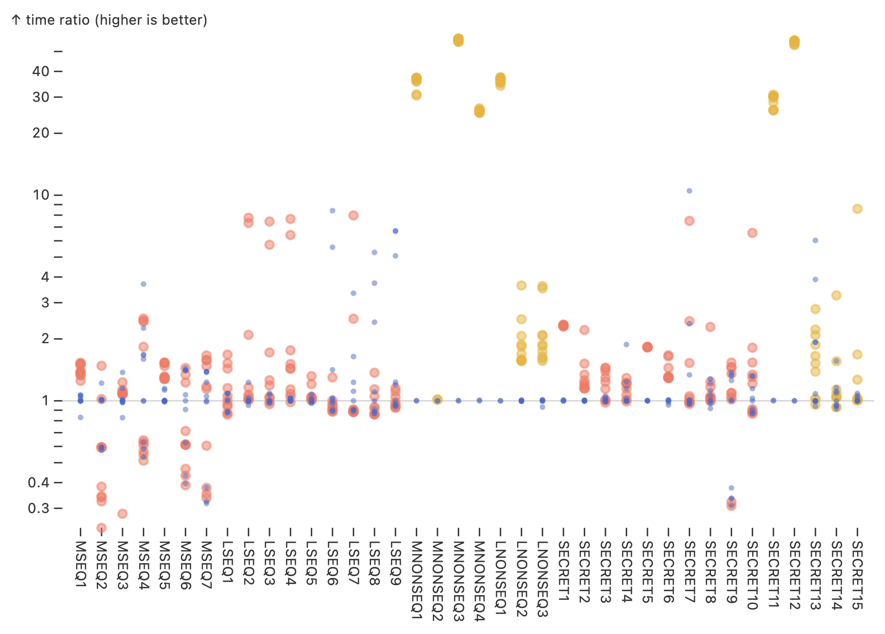

# High-performance Thread-safe IO
This is a high-performance C++ implementation of IO functions like read and write using a hybrid memory-mapping and caching scheme. Implementations are thread-safe and substantially faster than stdio counterparts. Main features include:
- `io61_read`: equivalent of `fread`; 
- `io61_write`: equivalent of `fwrite`; 
- `io61_seek`: equivalent of `fseek`. 

## Performance Summary

The below statistics were obtained via testing on a Linux system. 
- Averages 3-5x `stdio` performance overall. 
- Up to 40-50x performance boost over `stdio` on non-sequential read/write patterns (e.g., strided). 
- Matches or beats average `stdio` performance on *sequential reads and writes*. 

## Multithreading

Multithreading support was added via fine-grained file range locks. Threads that fail to grab the lock block instead of poll (i.e., busy-waiting) to avoid unnecessary consumption of CPU resources. 

## Other Details

The C++ implementations of `read` and `write` (along with the rest of the IO functions) can be found in `io61.cc`. There are two versions: 
- the `io61.cc` in the folder `Performance Version` does not support multithreading; 
- the `io61.cc` in the folder `Thread-safe Version` is a superset of the eponymous file in `Performance Version`; the only difference is that it is also thread-safe. 

Both performance and thread-safety tests can be run by typing `make run` in the terminal. 
